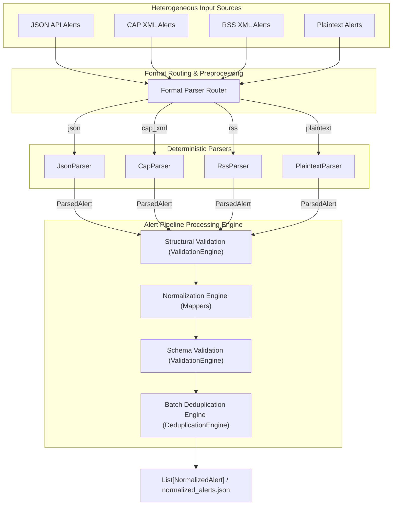
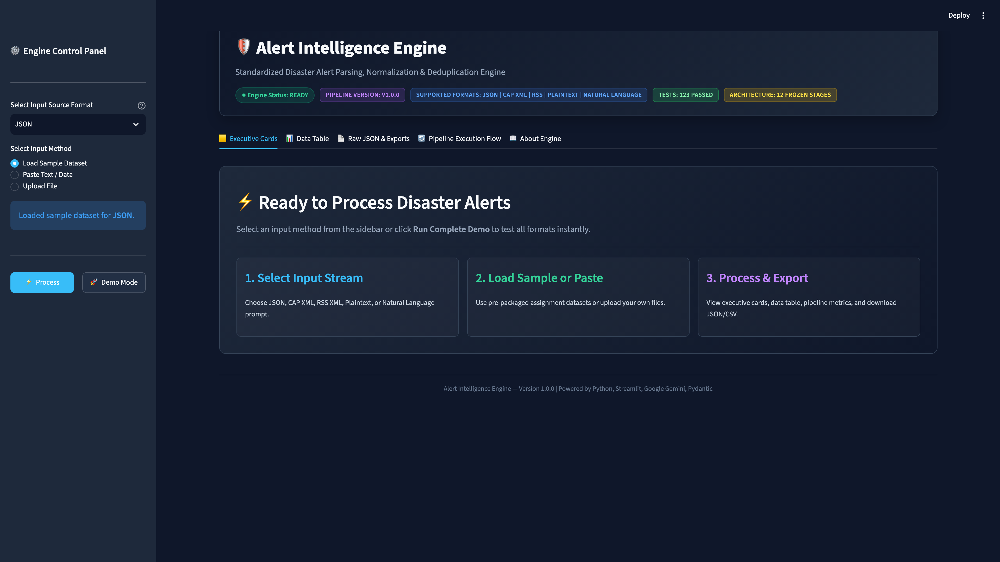
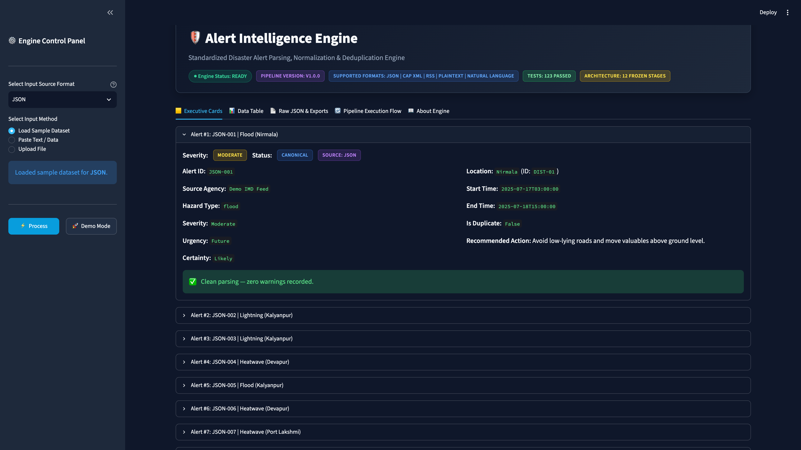
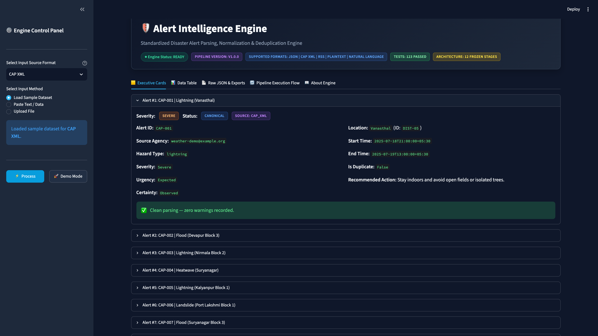
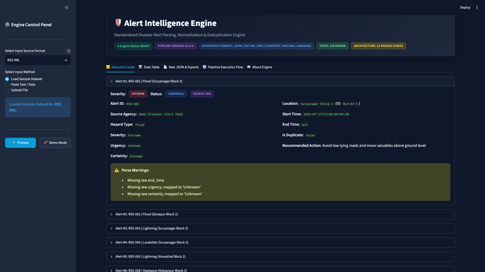
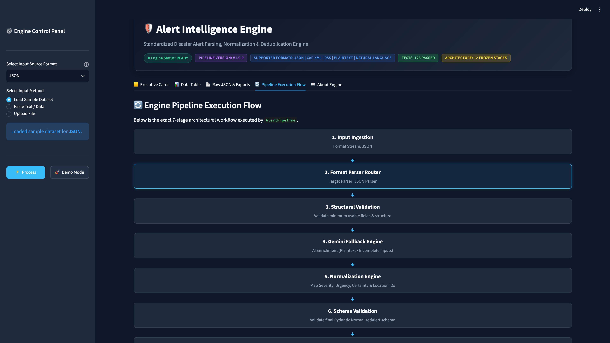
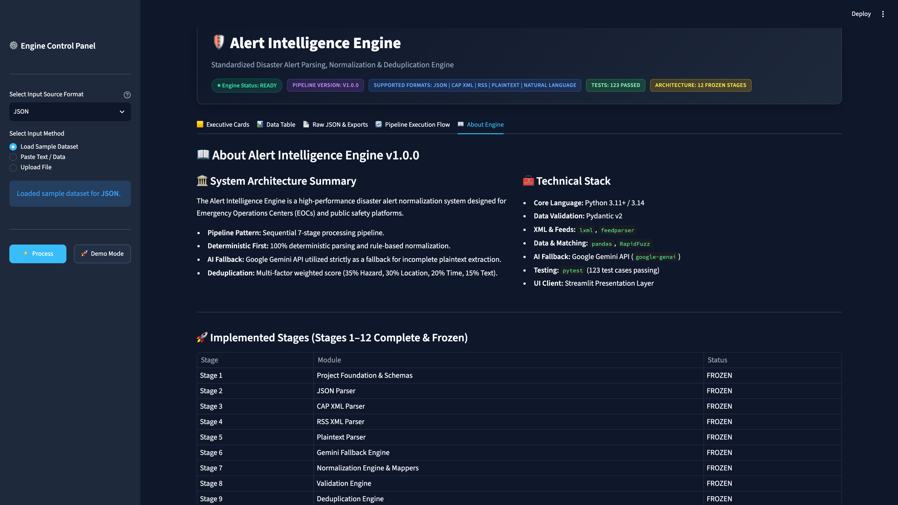

# Alert Intelligence Engine — Disaster Alert Parser & Normalizer

[](https://www.python.org/)
[](https://streamlit.io/)
[](tests/)
[](https://github.com/tkapilkishore-oss/alert-intelligence-engine)
[](https://alert-intelligence-engine.streamlit.app/)

**Version:** 1.0.0 | **Author:** Kapil Kishore | **Organization:** Resilience AI

The **Alert Intelligence Engine** is a production-grade disaster alert parsing, normalization, validation, and deduplication system. It ingests heterogeneous disaster alerts from multiple structured (JSON), semi-structured (CAP XML, RSS XML), and plaintext sources, extracts disaster information, normalizes fields against authoritative reference standards, validates outputs against unified schemas, detects duplicates across sources using multi-factor matching, and outputs standardized machine-readable JSON records (`normalized_alerts.json`).

---

## 🚀 Live Demo

**Web Application:** [https://alert-intelligence-engine.streamlit.app/](https://alert-intelligence-engine.streamlit.app/)

*The complete application can be explored directly in your browser without local installation.*

---

## ⚡ Quick Start

```
Clone Repository  ──►  Install Requirements  ──►  Run Streamlit  ──►  Process Alerts
```

1. **Clone Repository**:
   ```bash
   git clone https://github.com/tkapilkishore-oss/alert-intelligence-engine.git
   cd alert-intelligence-engine
   ```
2. **Install Requirements**:
   ```bash
   python3 -m venv .venv
   source .venv/bin/activate
   pip install -r requirements.txt
   ```
3. **Run Streamlit Dashboard**:
   ```bash
   streamlit run app.py
   ```
4. **Process Alerts**: Open `http://localhost:8501` to test JSON, CAP XML, RSS XML, & Plaintext alert processing.

---

## 🌟 Key Features & Tech Stack

| Category | Details & Specifications |
| :--- | :--- |
| **Supported Formats** | JSON (`json`), CAP XML 1.2 (`cap_xml`), RSS XML 2.0 (`rss`), Plaintext (`plaintext`) |
| **Parsing Engine** | Deterministic multi-format ingestion with high-speed regex pattern matching & XML/JSON schema parsing |
| **Normalization** | Unified mapping for Severity, Urgency, Certainty, NDMA District Location IDs, and ISO 8601 UTC Datetimes |
| **Deduplication** | Weighted multi-factor duplicate detection (Hazard, Location, Time-window matching score $\ge 0.75$) |
| **Validation** | Dual-pass validation: Structural Field Integrity + Pydantic v2 Schema Compliance (100% strict contracts) |
| **Core Technologies** | Python 3.11+, Streamlit 1.42+, Pydantic v2, Pandas, RapidFuzz, Pytest (130 tests passing) |

---

## 🏛️ Architecture Diagram



---

## 🔄 Pipeline Flow

```
Input Raw Data (JSON, CAP XML, RSS XML, Plaintext)
  │
  ▼
Format Parser Router
  │
  ▼
ParsedAlert (Unnormalized Intermediate Object)
  │
  ▼
Structural Validation (Minimum Field Integrity Check)
  │
  ▼
Normalization Engine (Severity, Urgency, Certainty, Location, Datetime Mappers)
  │
  ▼
Schema Validation (Pydantic Model Compliance Check)
  │
  ▼
Batch Deduplication Engine (Weighted Multi-Factor Match Score >= 0.75)
  │
  ▼
NormalizedAlert Records (Strict JSON Schema Output)
```

---

## 📥 Supported Input Formats

1. **JSON (`json`)**: Structured alert feeds containing explicit field names or alias maps.
2. **CAP XML (`cap_xml`)**: Common Alerting Protocol (CAP 1.2) XML feeds with standard element hierarchy.
3. **RSS XML (`rss`)**: XML feeds containing `<item>` disaster notifications and geo/category metadata.
4. **Plaintext (`plaintext`)**: Standardized plaintext alert notifications parsed deterministically using regex extraction.

---

## 🖥️ Streamlit Web Dashboard (Presentation Layer)

The project includes a modern, high-performance Streamlit presentation dashboard layer (`app.py`).

### Key Features
- **Zero Engine Modifications**: Client of the frozen `AlertPipeline`.
- **Sample Datasets**: One-click sample loading for JSON, CAP XML, RSS XML, and Plaintext inputs.
- **Processing Time Metric**: Execution speed measured in milliseconds (`time.perf_counter()`).
- **Real-Time Presentation Filters & Search**: Search by Alert ID, Location, or Hazard, with dropdown filters for Severity and Duplicate status.
- **Dual Result Views**: Executive Cards (expanders with color-coded severity/duplicate badges) + Compact Data Table (sortable grid).
- **Interactive Pipeline Flow Diagram**: Graphical pipeline visualizer highlighting active stage execution.
- **Raw JSON & One-Click Exports**: Instant Download JSON (`normalized_alerts.json`) and Download CSV (`normalized_alerts.csv`).
- **Complete Demo Mode**: One-click "Run Complete Demo" processing all supported input streams sequentially.
- **Error Handling Panels**: User-friendly styled warning panels for invalid JSON or broken XML payloads without app crashes.

### Launching the Dashboard Locally

```bash
# Activate virtual environment
source .venv/bin/activate

# Run Streamlit application
streamlit run app.py
```

Open `http://localhost:8501` in your browser.

---

## 📊 Dashboard Preview

### Home Dashboard

*Initial landing page displaying system architecture status badges, interactive format selector, and engine workflow overview.*

### JSON Processing

*Interactive processing of structured JSON alert feeds with normalized executive cards and status indicators.*

### CAP XML Processing

*Parsing and schema normalization of OASIS Common Alerting Protocol (CAP v1.2) XML feeds.*

### RSS Processing

*Ingestion of RSS 2.0 XML feeds with automatic fallback mapping and graceful parse warning logging.*

### Pipeline Visualization

*Interactive visual execution flow diagram highlighting the AlertPipeline architectural process.*

### About Page

*Comprehensive system specifications, technical stack breakdown, and implementation status across all engine stages.*

---

## 🌐 Streamlit Community Cloud Deployment

The repository is configured for 1-click deployment on **Streamlit Community Cloud**.

### Deployment Steps
1. Push this repository to GitHub.
2. Sign in to [Streamlit Community Cloud](https://share.streamlit.io/).
3. Click **New App** and select your repository, branch (`main`), and main file path (`app.py`).
4. Click **Deploy!**

---

## 💻 Running `demo.py`

Run the interactive CLI demonstration showcase:

```bash
.venv/bin/python demo.py
```

This demonstrates processing across all supported formats (JSON, CAP XML, RSS XML, Plaintext) and outputs a sequential summary report:

```
JSON : 14
CAP : 8
RSS : 10
PLAINTEXT : 9

TOTAL ALERTS : 41
TOTAL DUPLICATES : 2
```

---

## 🧪 Running Tests

Execute the complete test suite (130 test cases passing):

```bash
# Run complete system test suite
.venv/bin/pytest -v
```

---

## 📂 Project Structure

```
alert-intelligence-engine/
├── data/                             # Datasets and mapping references
│   ├── expected_normalized_schema.json
│   ├── golden_sample_instructions.json
│   ├── location_reference.csv
│   ├── raw_alerts_cap.xml
│   ├── raw_alerts_json.json
│   ├── raw_alerts_plaintext.txt
│   ├── raw_alerts_rss.xml
│   └── severity_mapping_reference.csv
├── docs/                             # Frozen project architecture documentation
│   ├── Design Decisions.txt
│   ├── Engineering Rules.txt
│   ├── Implementation Plan.txt
│   ├── Product Requirements Document (PRD).txt
│   ├── Stage Report Template.txt
│   └── Technical Requirements Document (TRD).txt
├── reports/                          # Stage completion and verification reports (Stages 1–12)
├── src/                              # Core engine source code
│   ├── mappers/                      # Value mapping modules (Severity, Urgency, Location, Datetime, etc.)
│   ├── parsers/                      # Format parsers (JSON, CAP XML, RSS, Plaintext)
│   ├── deduplicator.py               # Weighted batch deduplication engine
│   ├── gemini_extractor.py           # Stage 6 Gemini fallback module
│   ├── logger.py                     # Centralized logging module
│   ├── nlp_processor.py              # Stage 12 Natural Language Entry Layer
│   ├── normalization.py              # Normalization engine orchestrator
│   ├── pipeline.py                   # AlertPipeline core orchestration engine
│   ├── schema.py                     # Pydantic data models (ParsedAlert, NormalizedAlert)
│   └── validator.py                  # Structural and Schema Validation engine
├── tests/                            # Comprehensive Pytest test suites (130 tests)
├── app.py                            # Streamlit Web Dashboard application
├── demo.py                           # CLI showcase script
├── DEPLOYMENT.md                     # Deployment guide for Streamlit Cloud
├── requirements.txt                  # Dependency declaration
└── README.md                         # Project documentation
```

---

## 🎯 Design Philosophy

The Alert Intelligence Engine strictly adheres to **Ponytail Engineering Principles**:

- **YAGNI (You Aren't Gonna Need It)**: No speculative features, complex frameworks, or unnecessary abstraction layers.
- **Standard Library First**: Core parsing relies on Python standard libraries (`xml.etree.ElementTree`, `json`, `re`, `datetime`).
- **Deterministic First**: High-performance regex and XML/JSON parsing ensures zero downtime, zero external API latency, and 100% deterministic output.
- **Fault Tolerance**: Malformed input records never terminate batch processing; errors log warnings and continue execution.
- **Immutability & Typing**: Pydantic v2 models guarantee strict schema constraints and immutability.

---

## 📚 References

- [Common Alerting Protocol (CAP) Version 1.2 Specification](https://docs.oasis-open.org/emergency/cap/v1.2/CAP-v1.2-os.html)
- [RSS 2.0 Specification](https://www.rssboard.org/rss-specification)
- [Streamlit Documentation](https://docs.streamlit.io/)
- [Pydantic Documentation](https://docs.pydantic.dev/)
- [Python Standard Library Documentation](https://docs.python.org/3/)

---

## 🔮 Future Improvements

1. **GIS Geometry Support**: Expand `location_id` resolution to support GeoJSON polygon spatial matching.
2. **Asynchronous Batching**: Introduce `asyncio` parallel execution for high-throughput multi-feed polling.
3. **Streaming Ingestion**: Support Kafka / RabbitMQ streaming topics for real-time alert ingestion.
