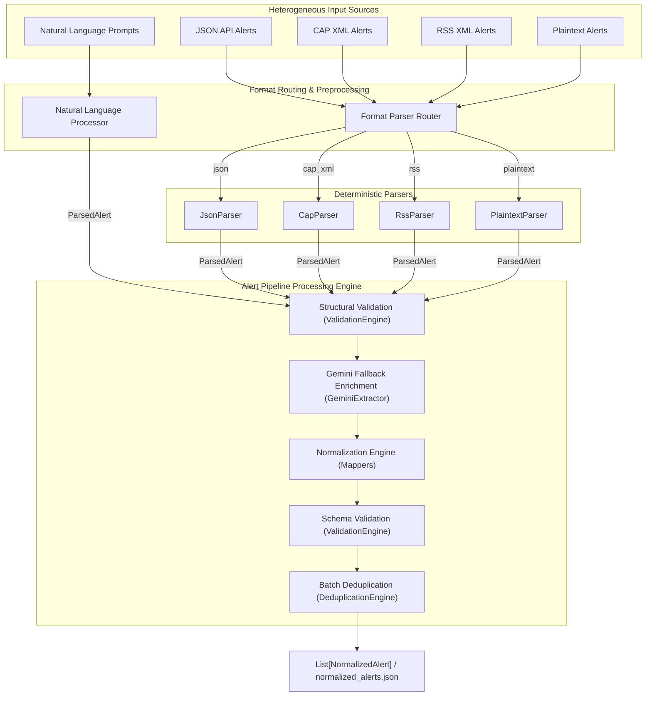

# Alert Intelligence Engine — Disaster Alert Parser & Normalizer

**Version:** 1.0  
**Author:** Kapil Kishore  
**Organization:** Resilience AI  

The **Alert Intelligence Engine** is a production-quality disaster alert parsing, normalization, validation, and deduplication system. It ingests heterogeneous disaster alerts from multiple structured, semi-structured, and natural language sources, extracts disaster information, normalizes fields against authoritative reference mappings, validates outputs against a unified schema, detects duplicates across sources, and outputs standardized machine-readable JSON records (`normalized_alerts.json`).

---

## Architecture Diagram



---

## Supported Input Formats

1. **JSON (`json`)**: Structured alert feeds containing explicit field names or alias maps.
2. **CAP XML (`cap_xml`)**: Common Alerting Protocol (CAP 1.2) XML feeds with standard element hierarchy.
3. **RSS XML (`rss`)**: XML feeds containing `<item>` disaster notifications and geo/category metadata.
4. **Plaintext (`plaintext`)**: Unstructured alert notifications parsed deterministically using regex extraction.
5. **Natural Language (`process_natural_language`)**: Free-form user inputs packaged into `ParsedAlert` objects and processed through the core pipeline.

---

## Natural Language Support

Stage 12 introduces an optional **Natural Language Entry Layer** (`NaturalLanguageProcessor`) that sits above the pipeline:

- Converts free-form text into `ParsedAlert(source="Natural Language Entry Layer", source_format="plaintext")`.
- Reuses the core pipeline (`AlertPipeline.process_natural_language(text)`).
- Zero duplicate Gemini code: uses the Stage 6 `GeminiExtractor` inside the pipeline for LLM-based field enrichment.
- Preserves parser philosophy: missing values remain `None`, warnings are recorded, and no speculative fields are invented.

---

## Gemini Fallback Explanation

Google Gemini API (`gemini-2.5-flash`) is used **strictly as a fallback enrichment engine** for incomplete plaintext alerts or natural language inputs.

- **Deterministic First**: Structured formats (JSON, CAP, RSS) and deterministic regex plaintext extractions bypass Gemini entirely.
- **Trigger**: Gemini is called ONLY if essential fields (`raw_hazard`, `raw_severity`, `raw_location`) are missing.
- **Merge Policy**: Existing parser extractions take priority; Gemini ONLY populates missing fields.
- **Resilience**: API key absence, rate limits (HTTP 429), or network timeouts append `parse_warnings` and gracefully proceed without breaking the batch.

---

## Pipeline Flow

```
Input Raw Data
  │
  ▼
Parser Router / Natural Language Processor
  │
  ▼
ParsedAlert (Unnormalized Intermediate Object)
  │
  ▼
Structural Validation (Minimum Field Integrity Check)
  │
  ▼
Gemini Fallback Enrichment (Plaintext / Natural Language Only)
  │
  ▼
Normalization Engine (Severity, Urgency, Certainty, Location, Datetime Mappers)
  │
  ▼
Schema Validation (Pydantic Model Compliance Check)
  │
  ▼
Batch Deduplication Engine (Weighted Multi-Factor Match Score >= 0.75)
  │
  ▼
NormalizedAlert Records (Strict JSON Schema Output)
```

---

## Installation

### Prerequisites
- Python 3.11+
- Virtual environment (`venv`)

### Setup

```bash
# Clone the repository
git clone https://github.com/tkapilkishore-oss/alert-intelligence-engine.git
cd alert-intelligence-engine

# Create and activate virtual environment
python3 -m venv .venv
source .venv/bin/activate

# Install dependencies
pip install -r requirements.txt
```

---

## Environment Variables

Copy `.env.example` to `.env` and set your optional Google Gemini API key:

```bash
cp .env.example .env
```

`.env` contents:
```env
GEMINI_API_KEY=your_google_gemini_api_key_here
```

*Note: If `GEMINI_API_KEY` is not provided, the pipeline continues using deterministic parsing and appends parse warnings when fallback is required.*

---

## Running `demo.py`

Run the interactive CLI demonstration showcase:

```bash
.venv/bin/python demo.py
```

This demonstrates processing across all supported formats (JSON, CAP XML, RSS XML, Plaintext, Natural Language) and outputs a sequential summary report:

```
JSON : 14
CAP : 8
RSS : 10
PLAINTEXT : 9

TOTAL ALERTS : 41
TOTAL DUPLICATES : 2
```

---

## Streamlit Web Dashboard (Presentation Layer)

The project includes a modern, high-performance Streamlit presentation dashboard layer (`app.py`).

### Key Features
- **Zero Engine Modifications**: Client of the frozen `AlertPipeline`.
- **Sample Datasets**: One-click sample loading for JSON, CAP XML, RSS XML, Plaintext, and Natural Language inputs.
- **Processing Time Metric**: Execution speed measured in milliseconds (`time.perf_counter()`).
- **Real-Time Presentation Filters & Search**: Search by Alert ID, Location, or Hazard, with dropdown filters for Severity and Duplicate status.
- **Dual Result Views**: Executive Cards (expanders with color-coded severity/duplicate badges) + Compact Data Table (sortable grid).
- **Interactive Pipeline Flow Diagram**: Graphical pipeline visualizer highlighting the active source format and Gemini fallback stage.
- **Raw JSON & One-Click Exports**: Instant Download JSON (`normalized_alerts.json`) and Download CSV (`normalized_alerts.csv`).
- **Complete Demo Mode**: One-click "Run Complete Demo" processing all 5 input streams sequentially.
- **Error Handling Panels**: User-friendly styled warning panels for invalid JSON, broken XML, or Gemini API limits without app crashes.

### Launching the Dashboard Locally

```bash
# Activate virtual environment
source .venv/bin/activate

# Run Streamlit application
streamlit run app.py
```

Open `http://localhost:8501` in your browser.

---

## Streamlit Community Cloud Deployment

The repository is configured for 1-click deployment on **Streamlit Community Cloud**.

### Deployment Steps
1. Push this repository to GitHub.
2. Sign in to [Streamlit Community Cloud](https://share.streamlit.io/).
3. Click **New App** and select your repository, branch (`main`), and main file path (`app.py`).
4. Under **Advanced settings** -> **Secrets**, add your optional Gemini API Key:
   ```toml
   GEMINI_API_KEY = "your_google_gemini_api_key_here"
   ```
5. Click **Deploy!**

*For comprehensive step-by-step instructions and troubleshooting, see [DEPLOYMENT.md](file:///Users/tkapilkishore/Desktop/alert-intelligence-engine/DEPLOYMENT.md).*


---

## Dashboard Screenshots Placeholder

> [!NOTE]
> Below are placeholders for visual dashboard documentation.

```
┌─────────────────────────────────────────────────────────────────────────────┐
│ 🛡️ Alert Intelligence Engine — Executive Dashboard                         │
│ [● Engine Status: READY] [Pipeline v1.0.0] [123 Tests Passed]                │
├─────────────────────────────────────────────────────────────────────────────┤
│ SUMMARY METRICS                                                             │
│ ┌───────────────┐ ┌───────────────┐ ┌───────────────┐ ┌──────────────────┐ │
│ │ Alerts: 14    │ │ Duplicates: 1 │ │ Warnings: 0   │ │ Speed: 18.2 ms   │ │
│ └───────────────┘ └───────────────┘ └───────────────┘ └──────────────────┘ │
├─────────────────────────────────────────────────────────────────────────────┤
│ EXECUTIVE RESULT CARDS                                                      │
│ 🔽 Alert #1: JSON-001 | Urban Flood (Nirmala) [MODERATE] [CANONICAL]        │
│ 🔽 Alert #2: JSON-002 | Lightning (Kalyanpur) [EXTREME] [CANONICAL]        │
│ 🔽 Alert #3: JSON-005 | Urban Flood (Kalyanpur) [EXTREME] [DUPLICATE]       │
└─────────────────────────────────────────────────────────────────────────────┘
```


---

## Running Tests

Execute the complete test suite (123 test cases):

```bash
# Run Stage 12 Natural Language unit tests
.venv/bin/pytest tests/test_nlp_processor.py -v

# Run complete system test suite
.venv/bin/pytest -v
```

---

## Project Structure

```
alert-intelligence-engine/
├── data/                             # Datasets and mapping references
│   ├── expected_normalized_schema.json
│   ├── golden_sample_instructions.json
│   ├── location_reference.csv
│   ├── raw_alerts_cap.xml
│   ├── raw_alerts_json.json
│   ├── raw_alerts_plaintext.txt
│   ├── raw_alerts_rss.xml
│   └── severity_mapping_reference.csv
├── docs/                             # Frozen project architecture documentation
│   ├── Design Decisions.txt
│   ├── Engineering Rules.txt
│   ├── Implementation Plan.txt
│   ├── Product Requirements Document (PRD).txt
│   ├── Stage Report Template.txt
│   └── Technical Requirements Document (TRD).txt
├── reports/                          # Stage completion and verification reports (Stages 1–12)
├── src/                              # Core engine source code
│   ├── mappers/                      # Value mapping modules (Severity, Urgency, Location, Datetime, etc.)
│   ├── parsers/                      # Format parsers (JSON, CAP XML, RSS, Plaintext)
│   ├── deduplicator.py               # Weighted batch deduplication engine
│   ├── gemini_extractor.py           # Stage 6 Gemini fallback module
│   ├── logger.py                     # Centralized logging module
│   ├── nlp_processor.py              # Stage 12 Natural Language Entry Layer
│   ├── normalization.py              # Normalization engine orchestrator
│   ├── pipeline.py                   # AlertPipeline core orchestration engine
│   ├── schema.py                     # Pydantic data models (ParsedAlert, NormalizedAlert)
│   └── validator.py                  # Structural and Schema Validation engine
├── tests/                            # Comprehensive Pytest test suites (123 tests)
├── demo.py                           # CLI showcase script
├── requirements.txt                  # Dependency declaration
├── README.md                         # Project documentation
└── .env.example                      # Environment configuration template
```

---

## Design Philosophy

The Alert Intelligence Engine strictly adheres to **Ponytail Engineering Principles**:

- **YAGNI (You Aren't Gonna Need It)**: No speculative features, complex frameworks, or unnecessary abstraction layers.
- **Standard Library First**: Core parsing relies on Python standard libraries (`xml.etree.ElementTree`, `json`, `re`, `datetime`).
- **Deterministic First**: AI (Gemini) is used only as a targeted fallback for missing plaintext fields.
- **Fault Tolerance**: Malformed input records never terminate batch processing; errors log warnings and continue execution.
- **Immutability & Typing**: Pydantic v2 models guarantee strict schema constraints and immutability.

---

## Future Improvements

1. **GIS Geometry Support**: Expand `location_id` resolution to support GeoJSON polygon spatial matching.
2. **Asynchronous Batching**: Introduce `asyncio` parallel execution for high-throughput multi-feed polling.
3. **Streaming Ingestion**: Support Kafka / RabbitMQ streaming topics for real-time alert ingestion.
